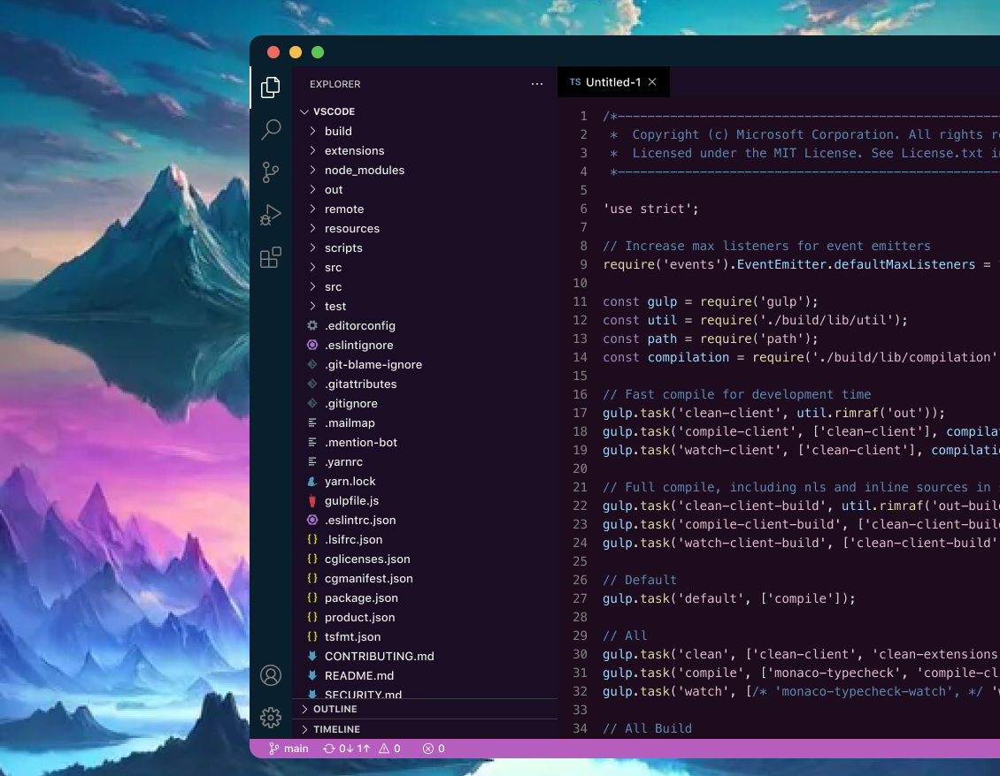

    

 
 

ethereal is a dark color theme for Visual Studio Code that is easy on the eyes and designed to be easy to read. It 
creates a calm and peaceful environment for you to procrastinate in. 

## Installation

Installation

1. Open Extensions sidebar panel in VS Code. `View → Extensions`
2. Search for `ethereal` - find the one by Brandon Kong.
3. Click Install to install it.
4. Click Reload to reload your editor
5. Code > Preferences > Color Theme > `ethereal`

- [Visual Studio Code Marketplace](https://marketplace.visualstudio.com/items?itemName=brandonkong.ethereal)
- [GitHub](https://www.github.com/brandon-kong/ethereal)
- [Open VSX Registry](https://open-vsx.org/extension/brandonkong/ethereal)

 

    

